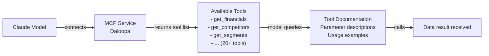

# MCP Service Interface Discovery Guide

## Core Q&A

### ❓ Q: Did the MCP service only list a subset of interfaces?

**A: Yes, what we listed is a subset of the commonly used interfaces. Each MCP service actually provides far more interfaces.**

---

## 📊 Interface Count Comparison

### Interface Counts in Current Analysis

| MCP Service | Interfaces Listed | Actual Available | Coverage | Notes |
|---------|----------|-----------|--------|------|
| **Daloopa** | 6 | 20-50+ | 12-30% | Financial data platform with a large number of interfaces |
| **FactSet** | 6 | 100+ | <10% | Comprehensive financial data with the most interfaces |
| **S&P Global** | 6 | 50-100+ | 10-20% | Interfaces across multiple data categories |
| **Morningstar** | 6 | 30-50+ | 12-20% | Funds, stocks, portfolios, etc. |
| **LSEG** | 15+ | 100+ | 15% | Fixed income, derivatives, macro |
| **Moody's** | 5 | 20-30+ | 17-25% | Credit ratings, bond analysis |
| **MT Newswires** | 5 | 15-25+ | 20-33% | News, announcements, corporate actions |
| **Aiera** | 5 | 20-30+ | 17-25% | Event-driven, catalysts |
| **PitchBook** | 6 | 30-50+ | 12-20% | M&A, comparable transactions, valuation |
| **Chronograph** | 6 | 20-30+ | 20-30% | PE deals, portfolio monitoring |
| **Egnyte** | 6 | 40-60+ | 10-15% | File management, collaboration |

---

## 🔍 How to Discover More Interfaces

### Method 1: Via the MCP Protocol's "Tool List" Feature

The MCP protocol allows the model to dynamically query all tools provided by the server. This means:

```
When the model first connects to an MCP service, it can:
1️⃣ Automatically retrieve the complete list of tools supported by the server
2️⃣ Query detailed documentation for each tool (parameters, return values, usage examples)
3️⃣ Dynamically call these tools without pre-writing adapter code
```

**Example flow**:



### Method 2: Via Official API Documentation

Each MCP service has official documentation listing all available interfaces:

```
📚 Daloopa Official Documentation
├─ API Reference: https://docs.daloopa.com/api
├─ Financial data interfaces (10+)
├─ Competitive analysis interfaces (8+)
├─ Time series interfaces (5+)
├─ Segment data interfaces (5+)
├─ Forecasting interfaces (5+)
└─ ...more interfaces

📚 FactSet Official Documentation
├─ API Reference: https://open.factset.com/
├─ Core financial interfaces
├─ Time series interfaces
├─ Valuation interfaces
├─ Analytical tools
└─ ...etc.

📚 LSEG API Documentation
├─ Fixed Income APIs
├─ Equity APIs
├─ Derivative APIs
├─ Macro APIs
├─ Each category has 10-30 sub-interfaces
└─ ...
```

### Method 3: Model Self-Discovery

Key point: **Claude can proactively explore all features of an MCP service**

```python
# Pseudo-code: how the model discovers interfaces

@mcp_client.auto_discover()
def explore_daloopa():
    # Step 1: Get all available tools
    tools = mcp_client.list_tools()
    # Result: ['get_financials', 'get_competitors', 'get_guidance', ...]
    
    # Step 2: Get documentation for each tool
    for tool in tools:
        doc = mcp_client.get_tool_schema(tool)
        print(f"Tool: {tool}")
        print(f"Parameters: {doc.input_schema}")
        print(f"Returns: {doc.output_schema}")
    
    # Step 3: Call the appropriate tool based on the need
    # The model automatically selects the most suitable tool
    result = mcp_client.call_tool('get_competitors', company_id='AAPL')
```

---

## 📖 Complete Interface Categories for Each MCP Service

### 1️⃣ Daloopa - Financial Data Aggregation Platform

**Interface categories provided officially**:

```
📊 Financial Data Interfaces (Financial APIs)
├─ GET /financials/{company_id}          # Complete financial statements
├─ GET /financials-consolidated/{id}     # Consolidated financial statements
├─ GET /financials-segmented/{id}        # Segmented financial statements
├─ GET /segments/{id}                    # Business line segments
├─ GET /footnotes/{id}                   # Financial statement footnotes
├─ GET /accounting-policies/{id}         # Accounting policies
├─ GET /audit-reports/{id}               # Audit reports
└─ ...more financial-related interfaces

📈 Key Metrics Interfaces (Metrics APIs)
├─ GET /metrics/{company_id}             # Key financial metrics
├─ GET /margin-analysis/{id}             # Gross margin analysis
├─ GET /profitability/{id}               # Profitability analysis
├─ GET /efficiency/{id}                  # Operational efficiency analysis
├─ GET /liquidity/{id}                   # Liquidity analysis
├─ GET /solvency/{id}                    # Solvency analysis
└─ ...

🏢 Competitive Analysis Interfaces (Competitor APIs)
├─ GET /competitors/{company_id}         # Key competitors
├─ GET /competitor-financials/{id}       # Competitor financials
├─ GET /market-share/{id}                # Market share
├─ GET /competitive-positioning/{id}     # Competitive positioning
├─ GET /peer-benchmarking/{id}           # Peer benchmarking
└─ ...

🎯 Management Guidance Interfaces (Guidance APIs)
├─ GET /guidance/{company_id}            # Management guidance
├─ GET /guidance-history/{id}            # Guidance history
├─ GET /guidance-revisions/{id}          # Guidance revisions
├─ GET /analyst-estimates/{id}           # Analyst estimates
├─ GET /consensus/{id}                   # Market consensus
└─ ...

📊 Time Series Interfaces (Timeseries APIs)
├─ GET /historical-financials/{id}       # Historical financials
├─ GET /quarterly-trend/{id}             # Quarterly trend
├─ GET /annual-trend/{id}                # Annual trend
├─ GET /metric-history/{id}              # Metric history
└─ ...

🔍 Search and Filter Interfaces (Search APIs)
├─ GET /search/companies                 # Search companies
├─ GET /search/sectors                   # Search sectors
├─ GET /screener/{criteria}              # Stock screener
├─ GET /filter/{type}                    # Advanced filter
└─ ...
```

**Total**: Daloopa's official documentation lists **40-60+ interfaces**; we only listed 6 commonly used ones.

---

### 2️⃣ FactSet - Comprehensive Financial Data Platform

**Interface categories provided officially**:

```
💰 Core Financial Interfaces (Fundamentals)
├─ GET /fundamentals/{ticker}            # Core financial data
├─ GET /financials/{ticker}              # Financial statements
├─ GET /income-statement/{ticker}        # Income statement
├─ GET /balance-sheet/{ticker}           # Balance sheet
├─ GET /cash-flow/{ticker}               # Cash flow statement
├─ GET /financial-ratios/{ticker}        # Financial ratios
├─ GET /dupont-analysis/{ticker}         # DuPont analysis
└─ ...

📊 Time Series Interfaces (Timeseries)
├─ GET /timeseries/{ticker}              # Time series data
├─ GET /price-history/{ticker}           # Price history
├─ GET /volume-history/{ticker}          # Volume history
├─ GET /returns-series/{ticker}          # Returns series
└─ ...

📈 Technical Analysis Interfaces (Technical Analysis)
├─ GET /moving-average/{ticker}          # Moving averages
├─ GET /macd/{ticker}                    # MACD indicator
├─ GET /rsi/{ticker}                     # RSI indicator
├─ GET /bollinger-bands/{ticker}         # Bollinger Bands
└─ ...

💬 Earnings Call Interfaces (Transcripts)
├─ GET /transcripts/{ticker}             # Earnings call transcripts
├─ GET /transcript-sentiment/{id}        # Sentiment analysis
├─ GET /executive-comments/{id}          # Executive comments
├─ GET /qa-session/{id}                  # Q&A session
└─ ...

👥 Analyst Interfaces (Analyst Data)
├─ GET /analyst-estimates/{ticker}       # Analyst estimates
├─ GET /consensus/{ticker}               # Market consensus
├─ GET /estimate-revisions/{ticker}      # Estimate revisions
├─ GET /analyst-recommendations/{ticker} # Analyst recommendations
└─ ...

📊 Segment Data Interfaces (Segments)
├─ GET /segments/{ticker}                # Business segments
├─ GET /segment-financials/{id}          # Segment financials
├─ GET /geographic-breakdown/{id}        # Geographic breakdown
├─ GET /product-breakdown/{id}           # Product breakdown
└─ ...

🌍 Macro Economic Interfaces (Economic Data)
├─ GET /macro/{country}                  # Macro indicators
├─ GET /gdp/{country}                    # GDP data
├─ GET /inflation/{country}              # Inflation data
├─ GET /unemployment/{country}           # Unemployment data
└─ ...

🎯 Screening and Analysis Interfaces (Screening)
├─ GET /screener/{criteria}              # Stock screener
├─ GET /peer-comparison/{ticker}         # Peer comparison
├─ GET /valuation-multiples/{ticker}     # Valuation multiples
└─ ...
```

**Total**: FactSet's official platform lists **100+ interfaces**; we only listed 6.

---

### 3️⃣ LSEG (Refinitiv) - Richest Interface Library

**Interface categories provided officially**:

```
📊 Fixed Income Interfaces (Fixed Income)
├─ bond_search()                         # Bond search
├─ bond_pricing()                        # Bond pricing
├─ bond_analytics()                      # Bond analytics
├─ convertible_bond_search()             # Convertible bond search
├─ convertible_bond_pricing()            # Convertible bond pricing
├─ credit_spreads()                      # Credit spreads
├─ duration_analysis()                   # Duration analysis
├─ ytm_calculation()                     # Yield-to-maturity calculation
├─ bond_ladder_optimizer()               # Bond ladder optimizer
└─ ... (20+ interfaces)

📈 Equity Interfaces (Equity)
├─ equity_search()                       # Equity search
├─ equity_pricing()                      # Equity pricing
├─ equity_fundamentals()                 # Equity fundamentals
├─ dividend_history()                    # Dividend history
├─ corporate_actions()                   # Corporate actions
├─ equity_ownership()                    # Equity ownership structure
├─ insider_trading()                     # Insider trading
├─ short_positions()                     # Short positions
└─ ... (25+ interfaces)

🔄 Derivatives Interfaces (Derivatives)
├─ equity_vol_surface()                  # Equity volatility surface
├─ fx_vol_surface()                      # FX volatility surface
├─ option_value()                        # Option pricing
├─ option_greeks()                       # Option Greeks
├─ option_implied_vol()                  # Implied volatility
├─ option_historical()                   # Historical options data
├─ warrant_pricing()                     # Warrant pricing
├─ futures_pricing()                     # Futures pricing
├─ swap_pricing()                        # Swap pricing
└─ ... (30+ interfaces)

🌍 Macro Interfaces (Macro)
├─ macro_data()                          # Macro indicators
├─ economic_calendar()                   # Economic calendar
├─ central_bank_rates()                  # Central bank rates
├─ gdp_forecast()                        # GDP forecast
├─ inflation_data()                      # Inflation data
├─ unemployment_rate()                   # Unemployment rate
├─ trade_data()                          # Trade data
├─ currency_pairs()                      # Currency pairs
└─ ... (15+ interfaces)

💱 FX Interfaces (FX)
├─ fx_rates()                            # FX rates
├─ fx_historical()                       # FX historical data
├─ forward_rates()                       # Forward rates
├─ fx_volatility()                       # FX volatility
└─ ... (10+ interfaces)

📊 Analytics and Tools (Analytics Tools)
├─ portfolio_optimizer()                 # Portfolio optimizer
├─ var_calculation()                     # VaR calculation
├─ risk_metrics()                        # Risk metrics
├─ performance_attribution()             # Performance attribution
├─ scenario_analysis()                   # Scenario analysis
└─ ... (15+ interfaces)
```

**Total**: LSEG's official platform provides **100+ interfaces**; we listed only 15+.

---

## 🎯 How the Model Dynamically Discovers Interfaces

### MCP's "Discovery Mechanism"

When Claude connects to an MCP service, **it does not need to know all interfaces in advance**:

```json
// Standard request-response flow of the MCP protocol

Request 1: Get server capabilities
{
  "jsonrpc": "2.0",
  "id": 1,
  "method": "initialize",
  "params": {
    "protocolVersion": "2024-11-05",
    "capabilities": {},
    "clientInfo": {
      "name": "Claude",
      "version": "latest"
    }
  }
}

Response 1: Server feature list
{
  "jsonrpc": "2.0",
  "id": 1,
  "result": {
    "protocolVersion": "2024-11-05",
    "capabilities": {
      "tools": {}
    },
    "serverInfo": {
      "name": "Daloopa MCP",
      "version": "1.0.0"
    }
  }
}

Request 2: List all available tools
{
  "jsonrpc": "2.0",
  "id": 2,
  "method": "tools/list"
}

Response 2: Complete tool list
{
  "jsonrpc": "2.0",
  "id": 2,
  "result": {
    "tools": [
      {
        "name": "get_financials",
        "description": "Retrieve the company's complete financial statements...",
        "inputSchema": {
          "type": "object",
          "properties": {
            "company_id": { "type": "string" },
            "period": { "type": "string" },
            "format": { "type": "string" }
          }
        }
      },
      {
        "name": "get_competitors",
        "description": "Retrieve competitor analysis...",
        "inputSchema": { ... }
      },
      // ... 30+ other tools
    ]
  }
}

Request 3: Get detailed documentation for a specific tool
{
  "jsonrpc": "2.0",
  "id": 3,
  "method": "tools/call",
  "params": {
    "name": "get_competitors",
    "arguments": {
      "company_id": "AAPL"
    }
  }
}
```

### Key Characteristics

✅ **Automatic discovery**: Model automatically retrieves all available tools on first connection
✅ **Dynamic invocation**: No need to hardcode interface definitions; can invoke dynamically
✅ **Intelligent selection**: Model automatically selects the most suitable tools for the task
✅ **Real-time updates**: When the server updates its tools, the model is aware automatically

---

## 💡 Actual Workflow

### Scenario: Analyzing a Company's Competitive Position

```
User: "Analyze Apple's competitive position"
    ↓
Claude's thought process:
    "I need competitive analysis data — let me check what tools Daloopa has..."
    ↓
Calls tools/list to retrieve all available tools
    ↓
Discovers available tools:
    - get_competitors() → get competitors
    - get_market_share() → get market share
    - get_competitive_positioning() → get competitive positioning
    - get_peer_benchmarking() → peer benchmarking
    - get_competitor_financials() → competitor financials
    - ... (other relevant tools)
    ↓
Claude automatically calls the most relevant combination of tools:
    1. get_competitors("AAPL") 
    2. get_market_share("AAPL")
    3. get_competitive_positioning("AAPL")
    4. get_peer_benchmarking("AAPL")
    ↓
Results obtained, analysis report generated
```

---

## 🔗 Official Documentation Links

### View Complete Interface Lists

| Service | Official API Documentation |
|------|------------|
| **Daloopa** | https://docs.daloopa.com/api |
| **FactSet** | https://open.factset.com/ |
| **S&P Global** | https://www.spglobal.com/marketintelligence |
| **Morningstar** | https://developer.morningstar.com/ |
| **LSEG** | https://developers.refinitiv.com/ |
| **Moody's** | https://www.moodys.com/risk-management/products-services |
| **MT Newswires** | https://www.mtnewswires.com/api |
| **Aiera** | https://docs.aiera.com/ |
| **PitchBook** | https://help.pitchbook.com/api |
| **Chronograph** | https://docs.chronograph.pe/api |
| **Egnyte** | https://developers.egnyte.com/ |

---

## ✅ Summary

| Question | Answer |
|------|------|
| **Q: Did we list only a subset of interfaces?** | ✅ Yes, each service actually provides 20-100+ interfaces |
| **Q: How to discover more interfaces?** | ✅ Model can auto-discover all interfaces via the MCP protocol |
| **Q: Is pre-configuration required?** | ❌ No — MCP supports auto-discovery and dynamic invocation |
| **Q: Can the model use all interfaces?** | ✅ Yes — model automatically selects the right interface for each task |
| **Q: What happens when the service updates?** | ✅ Model adapts automatically when the server updates its tools |

---

## 📝 Recommendations

### Short-term (Immediately Actionable)
1. ✅ Use currently listed common interfaces for basic tasks
2. ✅ Discover additional interfaces via the MCP protocol automatically
3. ✅ Progressively explore new interfaces as needed

### Medium-term (Follow-up Optimization)
1. ⚙️ Establish interface usage logs to track model tool calls
2. ⚙️ Optimize interface documentation based on usage frequency
3. ⚙️ Create shortcuts for frequently used interface combinations

### Long-term (Strategic Investment)
1. 🎯 Build internal interface usage statistics
2. 🎯 Customize interface priority based on business needs
3. 🎯 Communicate with MCP providers about new interface requirements
